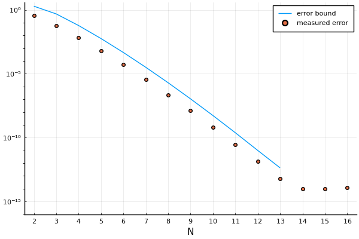

# Approximating maps into manifolds

Approximate functions of type $$\mathbb{R}^m \to M^n$$ where $M^n$ is an $n$-dimensional Riemannian manifold manifold.

To learn more about approximating maps into Riemannian manifolds, check out our preprint at [arxiv.org/abs/2403.16785](https://arxiv.org/abs/2403.16785).

If you use this software in your work, please cite
```
@misc{jacobsson2024,
      title={Approximating maps into manifolds with lower curvature bounds}, 
      author={Simon Jacobsson and Raf Vandebril and Joeri van der Veken and Nick Vannieuwenhoven},
      year={2024},
      eprint={2403.16785},
      archivePrefix={arXiv},
      primaryClass={math.NA}
}
```

`ManiFactor.jl` depends on `ApproximatingMapsBetweenLinearSpaces.jl`, which is available at [gitlab.kuleuven.be/numa/software/ApproximatingMapsBetweenLinearSpaces](https://gitlab.kuleuven.be/numa/software/ApproximatingMapsBetweenLinearSpaces).


## Example 1

Approximate
$$f \colon [-1, 1]^2 \to S^2, (x, y) \mapsto \mathrm{stereographic~projection}(x^2 - y^2, 2 x y)$$
using a varying number of sample points.
This figure illustrates the approximation accuracy by showing the image on $S^2$ of a grid in $[-1, 1]^2$:


## Example 2

Approximate
$$f \colon [-1, 1]^2 \to H^2, (x, y) \mapsto \mathrm{stereographic~projection}(x^2 - y^2, 2 x y)$$
using a varying number of sample points.
This figure illustrates the approximation accuracy by showing the image on $H^2$ of a grid in $[-1, 1]^2$:


## Example 3

Approximate
$$
f \colon [1, 2]  \to \mathrm{Gr}(100, 3), t \mapsto \mathrm{span}\{b, A(t) b, A(t)^2\}
$$
where $b$ is a random $100$-vector and $A(t)$ is the evaluation of the kernel
$$
K(x, x', t) = \frac{2}{\pi} \sum_{l = 1}^\infty \sin(l x) \sin(l x') \exp(-t l^2 / 4)
$$
on a $100 \times 100$ grid on $[0, \pi] \times [0, \pi]$.
The kernel appears when solving the heat equation on a finite interval with endpoints held at a fixed temperature.
This figure illustrates the approximation accuracy compared to what is predicted by the theory:


$N$ is the number of sample points in each direction, so that the total number of sample points is $N^2$.


## Example 4

Approximate
$$f \colon [-1, 1]^3 \to \mathrm{Segre}(30, 30), x \mapsto \frac{1}{2} \exp{x_1} \exp{(W_1 x_2)} e_1 (\exp{(W_2 x_3)} e_1)^\mathrm{T}$$
where $W_1$ and $W_2$ are randomly chosen antisymmetric $30 \times 30$ matrices and $e_1 = (1, 0, \dots, 0)$.
This figure illustrates the approximation accuracy compared to what is predicted by the theory:



$N$ is the number of sample points in each direction, so that the total number of sample points is $N^3$.
