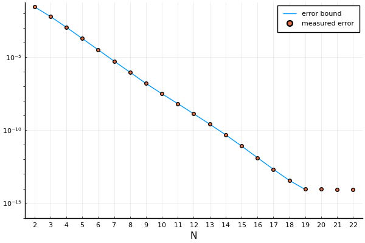

# Approximating maps into manifolds

Approximate functions of type $$\mathbb{R}^m \to M^n$$ where $M^n$ is an $n$-dimensional Riemannian manifold manifold.

Depends on `ApproximatingMapsBetweenLinearSpaces.jl`, which is available at TODO.

## Example 1

Approximate
$$f \colon [-1, 1]^2 \to S^2, (x, y) \mapsto \mathrm{stereographic~projection}(x^2 - y^2, 2 x y)$$
using a varying number of sample points.
This figure illustrates the approximation accuracy by showing the image on $S^2$ of a grid in $[-1, 1]^2$:

## Example 2

Approximate
$$f \colon [-1, 1]^2 \to H^2, (x, y) \mapsto \mathrm{stereographic~projection}(x^2 - y^2, 2 x y)$$
using a varying number of sample points.
This figure illustrates the approximation accuracy by showing the image on $H^2$ of a grid in $[-1, 1]^2$:

## Example 3

Approximate
$$f \colon [2, 4] \times [-1, 1] \to \mathrm{Gr}(100, 3), x \mapsto \mathrm{span}\{b, A(x) b, A(x)^2, A(x)^3 b\}$$
where $b$ is a random $100$-vector and
$$
A(x) = 100
\begin{bmatrix}
	2	&	-1		&\\
	-1	&	\ddots 	&	\ddots\\
		&	\ddots	&	2	&	-1\\
		&			&	-1	&	1
\end{bmatrix}
-
\frac{x_1}{600}
\begin{bmatrix}
	4	&	1		&\\
	1	&	\ddots 	&	\ddots\\
		&	\ddots	&	4	&	1\\
		&			&	1	&	2
\end{bmatrix}
+
\frac{x_1}{x_1 - x_2}
\begin{bmatrix}
	0	&			&\\
		&	\ddots	&	\\
		&			&	0	&	\\
		&			&		&	1
\end{bmatrix}
$$
See the [NLEVP](https://eprints.maths.manchester.ac.uk/2697/3/nlevp_ugVer4.pdf) repository.
This figure illustrates the approximation accuracy compared to what is predicted by the theory:

$N$ is the number of sample points in each direction, so that the total number of sample points is $N^2$.

TODO: cite article.

## Example 4

Approximate
$$f \colon [-1, 1]^3 \to \mathrm{Segre}(30, 30), x \mapsto \frac{1}{2} \exp{x_1} \exp{(W_1 x_2)} e_1 (\exp{(W_2 x_3)} e_1)^\mathrm{T}$$
where $W_1$ and $W_2$ are randomly chosen antisymmetric $30 \times 30$ matrices and $e_1 = (1, 0, \dots, 0)$.
This figure illustrates the approximation accuracy compared to what is predicted by the theory:

$N$ is the number of sample points in each direction, so that the total number of sample points is $N^3$.

TODO: cite article.
